# OCR-X Project: Architectural Variants

This document outlines three distinct architectural variants for the OCR-X project, each with different trade-offs regarding deployment, performance, and reliance on external services.

## Option A: Cloud-Hybrid Sophisticate

### 1. Overall Architecture Description

This approach combines the power of leading commercial cloud OCR APIs (Google Document AI, Azure AI Vision) for initial, high-accuracy text extraction and layout analysis, with locally executed custom modules for advanced pre-processing, specialized post-processing (including NLP error correction and simulated quantum-inspired refinement), and a rich Windows client experience. This aims for top-tier accuracy from cloud providers while allowing for innovative local enhancements and control over specific processing stages.

```mermaid
graph TD
    subgraph "User Environment (Windows)"
        A[Windows Client - .NET MAUI] -- Image/PDF Data --> B(Local Preprocessing Module);
        B -- Preprocessed Data --> C{Cloud OCR Gateway};
        C -- Data to Cloud --> D1[Google Document AI API];
        C -- Data to Cloud --> D2[Azure AI Vision API];
        D1 -- OCR Result --> E[Cloud Result Aggregator/Selector];
        D2 -- OCR Result --> E;
        E -- Selected OCR Data --> F(Local Post-Processing Module);
        F -- Corrected Text --> G[Output to Client];
        A <-. Settings & Control .-> C;
        A <-. Settings & Control .-> F;
    end

    subgraph "Cloud Services (External)"
        D1;
        D2;
    end

    subgraph "Local Advanced Modules"
        B[Preprocessing - OpenCV, Custom Filters];
        F[Post-Processing - ByT5, Qiskit-Simulated Quantum Correction];
    end

    style A fill:#D6EAF8,stroke:#333,stroke-width:2px
    style B fill:#D1F2EB,stroke:#333,stroke-width:2px
    style C fill:#FCF3CF,stroke:#333,stroke-width:2px
    style D1 fill:#FADBD8,stroke:#333,stroke-width:2px
    style D2 fill:#FADBD8,stroke:#333,stroke-width:2px
    style E fill:#EBDEF0,stroke:#333,stroke-width:2px
    style F fill:#D1F2EB,stroke:#333,stroke-width:2px
    style G fill:#D6EAF8,stroke:#333,stroke-width:2px
```



### 2. Key Components & Technologies

*   **Preprocessing:**
    *   Locally executed module.
    *   Libraries: OpenCV for standard image manipulations (deskew, contrast, scaling).
    *   Custom implementations for advanced binarization (e.g., a U-Net like model implemented in PyTorch/ONNX, or advanced Sauvola/Niblack variants) if cloud preprocessing is insufficient for specific edge cases.
    *   Geometric correction using local models (e.g., DeepXY simulation or PerspectiveNPoint if control points can be identified) before sending to cloud, or for refining cloud output coordinates.
*   **Core Recognition Engine(s):**
    *   Primary reliance on **Google Document AI** and/or **Microsoft Azure AI Vision (Read API/Document Intelligence)**.
    *   The "Cloud OCR Gateway" component will abstract the interaction, manage API keys, and potentially allow dynamic selection based on document type or user preference.
    *   Custom parts handle data marshalling, API call management, and parsing of results from the cloud services. No local core OCR engine is the primary path.
*   **Post-Processing:**
    *   Locally executed module.
    *   **NLP Model:** Fine-tuned **ByT5** (e.g., `google/byt5-small`) implemented in PyTorch/ONNX, running locally for correcting common OCR errors or context-specific mistakes not caught by cloud APIs.
    *   **Simulated Quantum Error Correction:**
        *   A Qiskit-based simulation for specific, patterned character ambiguities (e.g., 'I'/'l'/'1', 'O'/'0').
        *   Formulate ambiguities as a Quadratic Unconstrained Binary Optimization (QUBO) problem. For example, if "l0cal" is OCRed and context suggests "local" or "10cal", the 'l'/'1' and '0'/'O' choices could be nodes in a graph, with edge weights derived from language model probabilities or character visual similarity.
        *   Use Qiskit's VQE (Variational Quantum Eigensolver) or QAOA (Quantum Approximate Optimization Algorithm) simulators to find the optimal character assignments that minimize the QUBO. This remains a simulation, not actual quantum hardware.
*   **Windows Client:**
    *   **UI Technology:** **.NET MAUI** for a modern Windows 11 look-and-feel, cross-platform potential (if desired later), and good integration with C# backend logic.
    *   **Interaction:** The client gathers input, sends data to the local preprocessing module, then to the Cloud OCR Gateway. It receives processed data from the local post-processing module for display. It manages user settings for API keys, preferred cloud provider, and post-processing options.
*   **Data Management:**
    *   **Ground Truth/Synthetic Data:** Stored in a cloud storage solution (e.g., Azure Blob Storage, Google Cloud Storage) or a local NAS, accessible for fine-tuning local post-processing models.
    *   **Models:** Cloud OCR models are managed by providers. Local preprocessing/post-processing models (ONNX format) deployed with the client application package or downloaded on demand.
*   **APIs/Integration Points:**
    *   External: REST APIs of Google Document AI and Azure AI Vision.
    *   Internal: Python/C# APIs between the .NET MAUI client and local Python-based processing modules (potentially using inter-process communication like gRPC or a simple REST API if Python modules are run as a separate local service).

### 3. Performance Considerations

*   **Expected Accuracy Range:**
    *   CER: Potentially <0.5% - 1.5% (Leveraging SOTA cloud OCR, but final accuracy depends on cloud provider's performance on specific document types and efficacy of local post-processing).
    *   WER: Potentially <1.0% - 2.5%.
*   **Expected Speed/Latency:**
    *   Dominated by cloud API call latency (typically 1-5 seconds per page, can be higher for very large/complex documents). Batching can improve throughput.
    *   Local pre/post-processing will add some overhead (e.g., 100-500ms per page for NLP, simulation part will be slower but targeted).
*   **Scalability Approach:**
    *   Scalability is largely handled by the cloud providers for the core OCR task.
    *   Local client is single-user focused, but backend for model fine-tuning (if any) would need separate scaling considerations.

### 4. Windows Integration Strategy

*   **Native Windows Features:**
    *   **DirectML:** Could be used for local pre/post-processing models (ByT5, U-Net) if converted to ONNX and run via ONNX Runtime with DirectML execution provider, offering hardware acceleration.
    *   **WinRT APIs:** For file pickers, notifications, and other native OS interactions via .NET MAUI.
    *   **MSIX Packaging:** For streamlined deployment and updates on Windows.
*   **User Experience:**
    *   Responsive UI by offloading heavy processing to background threads.
    *   Clear feedback on processing status, especially during cloud API calls.
    *   Secure storage of API keys (e.g., using Windows Credential Manager).
    *   Native Windows 11 styling through .NET MAUI.

## Option B: On-Premise Powerhouse

### 1. Overall Architecture Description

This variant focuses on a fully on-premise solution, prioritizing data privacy and control. It leverages a powerful ensemble of open-source OCR engines and custom-trained models, running entirely on the user's Windows machine or local network. Performance and accuracy are maximized through local hardware optimization (especially DirectML) and sophisticated pre/post-processing pipelines.

```mermaid
graph TD
    subgraph "User Environment (Windows)"
        A[Windows Client - Python with PyQt/WinUI 3] -- Image/PDF Data --> B(Preprocessing Module);
        B -- Preprocessed Data --> C{Core OCR Engine - Ensemble};
        C -- Raw OCR Data --> D(Post-Processing Module);
        D -- Corrected Text --> E[Output to Client];
        C -.-> F(Model Management & Retraining);
    end

    subgraph "Local OCR Core & Processing Pipeline"
        direction LR
        B[Preprocessing - OpenCV, U-Net (ONNX)];
        C[Recognition Ensemble - PaddleOCR PP-OCRv4 + SVTR (ONNX/DirectML)];
        D[PostProcessing - ByT5 (ONNX/DirectML), Qiskit-Simulated Quantum Correction];
    end

    subgraph "Local Data & Model Management"
        F[Synthetic Data Gen & Model Store];
    end

    style A fill:#D6EAF8,stroke:#333,stroke-width:2px
    style B fill:#D1F2EB,stroke:#333,stroke-width:2px
    style C fill:#AED6F1,stroke:#333,stroke-width:2px
    style D fill:#D1F2EB,stroke:#333,stroke-width:2px
    style E fill:#D6EAF8,stroke:#333,stroke-width:2px
    style F fill:#E8DAEF,stroke:#333,stroke-width:2px
```

### 2. Key Components & Technologies

*   **Preprocessing:**
    *   Libraries: OpenCV for image manipulation.
    *   Models: U-Net based binarization (PyTorch/TensorFlow converted to ONNX), DeepXY simulation for geometric correction (ONNX). All models run locally using ONNX Runtime with DirectML.
*   **Core Recognition Engine(s):**
    *   **Primary Engine:** Ensemble of **PaddleOCR PP-OCRv4** (detection and recognition models) and **SVTR** (for robust text recognition). Models converted to ONNX for DirectML execution.
    *   **Optimization:** Quantization (INT8) of ONNX models for speed, specific tuning of model parameters for target document types. Engine runs entirely locally.
    *   Ensembling strategy: Could be rule-based (e.g., use SVTR for lines with detected complex scripts/fonts) or weighted voting based on confidence scores.
*   **Post-Processing:**
    *   **NLP Model:** Fine-tuned **ByT5** (ONNX/DirectML) for error correction.
    *   **Simulated Quantum Error Correction:** Qiskit-based QUBO formulation and simulation (as described in Option A) for resolving specific character ambiguities, running locally.
*   **Windows Client:**
    *   **UI Technology:** Python with **PyQt6** or **WinUI 3 via Python/C# bridge (e.g. CsWinRT)**. PyQt offers robust cross-platform capabilities if needed later, while WinUI 3 gives the most native Windows 11 experience.
    *   **Interaction:** Client manages the entire OCR pipeline locally. Preprocessing, OCR, and post-processing modules are likely Python classes/functions called directly. Heavy operations run in separate threads to keep UI responsive.
*   **Data Management:**
    *   **Ground Truth/Synthetic Data:** Stored on local disk or a shared network drive. Tools like TRDG (TextRecognitionDataGenerator) integrated for synthetic data generation.
    *   **Models:** All models (preprocessing, OCR, post-processing) stored locally as ONNX files, packaged with the application or downloaded/updated from a central model repository (could be a simple file server or Git LFS).
*   **APIs/Integration Points:**
    *   Internal Python APIs for communication between client and OCR pipeline components.
    *   No external API calls for core OCR functionality.

### 3. Performance Considerations

*   **Expected Accuracy Range:**
    *   CER: 0.7% - 2.0% (Highly dependent on quality of open-source models, fine-tuning, and effectiveness of pre/post-processing). Ambitious target for fully on-premise.
    *   WER: 1.5% - 3.5%.
*   **Expected Speed/Latency:**
    *   Speed: Aiming for 10-20 PPM on DirectML-compatible GPU, 3-7 PPM on modern CPU.
    *   Latency: Lower latency per page compared to cloud, as no network overhead (e.g., 500ms - 2s per page, depending on complexity and hardware).
*   **Scalability Approach:**
    *   Single-machine focus. Scalability is achieved by running on more powerful hardware. For batch processing, can utilize all available CPU cores and GPU.
    *   No inherent multi-user scalability unless deployed on a powerful local server with a custom job management system.

### 4. Windows Integration Strategy

*   **Native Windows Features:**
    *   **DirectML:** Critical for performance. All deep learning models (preprocessing, OCR, post-processing) to be run via ONNX Runtime with the DirectML execution provider.
    *   **Windows APIs:** For file system access, UI elements (if using WinUI 3), and potentially for background tasks.
    *   **MSIX Packaging:** For distribution and updates.
*   **User Experience:**
    *   Fully offline capability is a key selling point.
    *   UI to provide detailed progress and control over local processing.
    *   Installation should be straightforward with all dependencies bundled.
    *   Performance tuning options exposed to user (e.g., select CPU/GPU, batch size).

## Option C: Edge-Optimized Monolith

### 1. Overall Architecture Description

This variant is designed for maximum portability and efficiency on resource-constrained Windows devices (e.g., tablets, older laptops). It features a lightweight, monolithic architecture where all components are tightly integrated into a single application. Models are heavily quantized and optimized for speed and minimal footprint, potentially sacrificing some accuracy for performance on edge hardware.

```mermaid
graph TD
    subgraph "Windows Edge Device"
        direction LR
        A[Input Image/PDF via Windows Client] --> B(Lite Preprocessing);
        B -- Data --> C(Lite Core OCR Engine);
        C -- Data --> D(Lite Post-Processing);
        D -- Text --> E[Output to Client];

        F[Windows Client - Python with Tkinter/Lightweight .NET];
        F <--> A;
        F <--> E;

        subgraph "Integrated OCR Pipeline (Monolith)"
            B[Preprocessing - OpenCV (Simplified)];
            C[Recognition - PP-OCR Mobile Quantized / MobileNet OCR];
            D[PostProcessing - Rule-Based / Small NLP model];
        end
    end

    style A fill:#D6EAF8,stroke:#333,stroke-width:2px
    style B fill:#D0ECE7,stroke:#333,stroke-width:2px
    style C fill:#A9CCE3,stroke:#333,stroke-width:2px
    style D fill:#D0ECE7,stroke:#333,stroke-width:2px
    style E fill:#D6EAF8,stroke:#333,stroke-width:2px
    style F fill:#FDF2E9,stroke:#333,stroke-width:2px
```

### 2. Key Components & Technologies

*   **Preprocessing:**
    *   Libraries: OpenCV for essential, fast operations (e.g., Otsu binarization, basic deskew).
    *   No heavy deep learning models for preprocessing to save resources. Focus on computationally cheap algorithms.
*   **Core Recognition Engine(s):**
    *   **Primary Engine:** A highly quantized version of a lightweight model, e.g., **PaddleOCR Mobile (INT8 quantized)** or a custom MobileNetV3-based OCR model.
    *   **Optimization:** Model pruning and further quantization. Focus on minimal model size (e.g., <5-10MB for recognition model). All execution via ONNX Runtime with DirectML where available, or CPU.
*   **Post-Processing:**
    *   **NLP Model:** Simple rule-based corrections (e.g., dictionary lookups for common misspellings, regex for pattern correction). If an NLP model is used, it would be extremely small (e.g., a distilled BiLSTM or a very small transformer variant, <10-20MB).
    *   **Simulated Quantum Error Correction:** Likely omitted due to computational cost on edge devices, unless a very simplified, targeted heuristic version could be developed.
*   **Windows Client:**
    *   **UI Technology:** Python with **Tkinter** for minimal dependencies and footprint, or a lightweight .NET framework like **Windows Forms with C#** if Python overhead is too much.
    *   **Interaction:** A single executable containing all logic. OCR operations are direct function calls within the application.
*   **Data Management:**
    *   **Ground Truth/Synthetic Data:** Not typically managed or used on the edge device itself. Model training and data management happen offline/server-side.
    *   **Models:** All models are embedded within the application package, highly optimized and quantized.
*   **APIs/Integration Points:**
    *   Primarily internal function calls.
    *   May offer command-line interface for scripting or basic integration.

### 3. Performance Considerations

*   **Expected Accuracy Range:**
    *   CER: 1.5% - 5.0% (Accuracy is traded for speed and size).
    *   WER: 3.0% - 8.0%.
*   **Expected Speed/Latency:**
    *   Speed: Focus on fast single-page processing, e.g., 1-3 seconds per page on CPU, potentially sub-second with DirectML on capable edge GPUs. PPM may be lower due to focus on individual interactions (e.g. 5-15 PPM).
    *   Latency: Very low latency for interactive use is a primary goal.
*   **Scalability Approach:**
    *   Not designed for high-volume batch processing. Scalability is per-device.
    *   Optimized for single-user responsiveness on one device.

### 4. Windows Integration Strategy

*   **Native Windows Features:**
    *   **DirectML:** If available on the edge device's GPU, it would be leveraged via ONNX Runtime for significant speedup. CPU fallback is essential.
    *   **MSIX Packaging:** For reliable installation and updates.
    *   **Windows Power Management APIs:** Application could be designed to be power-aware, reducing background activity to conserve battery on mobile Windows devices.
*   **User Experience:**
    *   Extremely fast startup and processing of individual images/screenshots.
    *   Minimal resource footprint (RAM, CPU).
    *   Simple, clean UI optimized for touch if applicable.
    *   Offline first; no internet connectivity required.

This document provides a foundational blueprint for discussing and selecting the most suitable architectural direction for OCR-X. Each option has distinct advantages and challenges that need to be weighed against project priorities.
