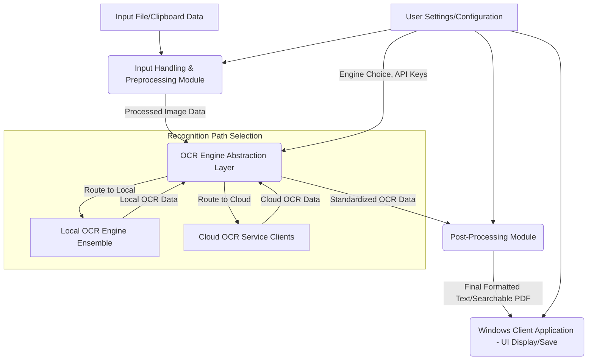
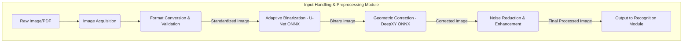

# OCR-X Project: Component Breakdown (Option B - Flexible Hybrid Powerhouse)

This document details the component breakdown for the OCR-X project, based on the selected architecture: Option B - Flexible Hybrid Powerhouse. This architecture combines a robust on-premise OCR capability (using open-source engines, custom models, and DirectML) with the flexibility to integrate and utilize commercial cloud OCR APIs.

## 1. Core OCR Pipeline Components

### 1.1. Input Handling & Preprocessing Module

This module is responsible for taking raw input (images, PDFs) and preparing it for the recognition engine.

*   **Sub-component: Image Acquisition:**
    *   **Functionality:** Handles input from various sources:
        *   Files: PDF (extracting images page by page), JPG, PNG, TIFF, BMP.
        *   Clipboard: Capturing image data from the system clipboard.
    *   **Technology:** Python libraries like `Pillow` (PIL), `PyMuPDF` (for PDF image extraction), `PyQt/WinUI 3` clipboard APIs.
*   **Sub-component: Format Conversion & Initial Validation:**
    *   **Functionality:** Converts diverse input image formats into a standardized internal representation (e.g., OpenCV `cv::Mat` object, typically BGR NumPy array). Performs basic validation like checking for corrupted files or zero-byte images.
    *   **Technology:** `OpenCV`, `NumPy`.
*   **Sub-component: Adaptive Binarization:**
    *   **Functionality:** Applies advanced binarization techniques to convert grayscale images to binary, critical for OCR. Simulates a U-Net based approach for dynamic thresholding, capable of handling uneven illumination.
    *   **Input:** Grayscale image (e.g., single-channel NumPy array).
    *   **Output:** Binary image (NumPy array with values 0 or 255).
    *   **Technology:** `OpenCV` for basic methods (Otsu, Sauvola), `TensorFlow/Keras` or `PyTorch` for U-Net model (converted to ONNX for inference via ONNX Runtime + DirectML).
*   **Sub-component: Geometric Correction:**
    *   **Functionality:** Corrects geometric distortions such as skew and perspective. Simulates a DeepXY based approach or similar learned method.
    *   **Input:** Binary or grayscale image (NumPy array).
    *   **Output:** Geometrically corrected image (NumPy array), potentially with transformation matrix.
    *   **Technology:** `OpenCV` for affine/perspective transformations, `TensorFlow/Keras` or `PyTorch` for the deep learning model (converted to ONNX for inference via ONNX Runtime + DirectML).
*   **Sub-component: Noise Reduction & Enhancement:**
    *   **Functionality:** Applies filters to reduce noise (e.g., Gaussian, salt-and-pepper) and enhance text clarity. Techniques include non-local means denoising, wavelet transforms for multi-resolution analysis, and Contrast Limited Adaptive Histogram Equalization (CLAHE).
    *   **Input:** Binary or grayscale image (NumPy array).
    *   **Output:** Denoised/enhanced image (NumPy array).
    *   **Technology:** `OpenCV`, `scikit-image`, `PyWavelets`.
*   **Interface (Preprocessing Module):**
    *   **Input:** Raw image file path, image data from clipboard, or raw bytes. Configuration parameters for preprocessing steps.
    *   **Output:** A list/batch of processed images (e.g., binary NumPy arrays), optimized for the recognition module. Metadata about processing steps applied.

### 1.2. Recognition & Abstraction Layer

This module is responsible for performing the core text recognition by dispatching requests to the appropriate OCR engine (local or cloud) via an abstraction layer, and then normalizing the results.

*   **Sub-component: OCR Engine Abstraction Layer:**
    *   **Functionality:** Acts as a central routing point for OCR requests. It receives processed images and configuration from the `OCR Workflow Orchestrator`, selects the appropriate OCR engine (local ensemble or a specific cloud service client) based on this configuration, invokes the chosen engine, and normalizes its output into a standardized format.
    *   **Technology:** Custom Python logic.
    *   **Inputs:** Processed image data, configuration specifying engine choice (e.g., "local", "google", "azure") and any engine-specific parameters (e.g., API keys if managed here, language hints).
    *   **Outputs:** Standardized OCR data structure (text, bounding boxes, confidence scores).

*   **Sub-component: Local OCR Engine Ensemble:**
    *   **Functionality:** Manages and executes the locally installed OCR engines. This includes:
        *   **PaddleOCR Engine Integration:** Wrapper for PaddleOCR's PP-OCRv4 (or latest stable) detection and recognition models. Configured for high accuracy and optimized for English text. (Technology: `PaddlePaddle`, `PaddleOCR` Python library).
        *   **SVTR Engine Integration:** Wrapper for a Scene Text Recognition model like SVTR-Large. (Technology: `PyTorch` or `TensorFlow` for model, custom Python wrapper).
        *   **Local Ensemble/Voting Logic:** Implements strategies for combining results if multiple local OCR engines are used concurrently (e.g., confidence-based weighting, primary/secondary). (Technology: Custom Python logic).
    *   **Technology:** As listed above; all local models are intended to be run via ONNX Runtime with DirectML.
    *   **Inputs:** Processed image data from the Abstraction Layer.
    *   **Outputs:** Raw OCR data in the native format of the local engine(s) to the Abstraction Layer.

*   **Sub-component: Cloud OCR Service Clients (Google & Azure):**
    *   **Functionality:** Individual clients responsible for interacting with specific commercial cloud OCR APIs.
        *   **Google Document AI Client:** Handles authentication, request formatting, API calls to Google Document AI, and parsing of its responses. (Technology: `google-cloud-documentai` Python library).
        *   **Azure AI Vision Client:** Handles authentication, request formatting, API calls to Azure AI Vision (Read API or Document Intelligence), and parsing of its responses. (Technology: `azure-ai-vision-imageanalysis` or `azure-ai-formrecognizer` Python library).
    *   **Technology:** As listed above, Python SDKs provided by Google and Microsoft.
    *   **Inputs:** Processed image data and API credentials/configuration from the Abstraction Layer.
    *   **Outputs:** Raw OCR data in the native format of the respective cloud API to the Abstraction Layer.

*   **Sub-component: ONNX Conversion & DirectML Optimization (for Local Engines):**
    *   **Functionality:** Process and scripts for converting local models (PaddleOCR, SVTR, preprocessing models like U-Net, DeepXY) to ONNX format. Configuration for inference using `ONNX Runtime` with the DirectML execution provider for GPU acceleration on Windows. Includes model quantization.
    *   **Technology:** `ONNX`, `ONNX Runtime`, `tf2onnx`, `paddle2onnx`, `pytorch-onnx`.

*   **Interface (OCR Engine Abstraction Layer):**
    *   **Input:** Batch of processed images (binary NumPy arrays) from the Preprocessing Module. Configuration object specifying which engine to use (local, Google, Azure) and any necessary credentials or engine-specific parameters.
    *   **Output:** Standardized structured data containing:
        *   Recognized text strings.
        *   Confidence scores (per character, word, or line).
        *   Bounding box coordinates (for words, lines, or characters).
        *   Information about which engine (local type or cloud provider) produced the result.

### 1.3. Post-Processing Module

This module refines the raw OCR output and prepares it for the user.

*   **Sub-component: NLP-based Error Correction:**
    *   **Functionality:** Integrates a ByT5 (or similar sequence-to-sequence) model fine-tuned on OCR error patterns to correct contextual errors, non-word errors, and common misrecognitions.
    *   **Input:** Raw OCR text strings (potentially with confidence scores).
    *   **Output:** Corrected text strings.
    *   **Technology:** `HuggingFace Transformers` library, `PyTorch` or `TensorFlow` (ByT5 model converted to ONNX for inference via ONNX Runtime + DirectML).
*   **Sub-component: Simulated Quantum Error Correction:**
    *   **Functionality:** Implements a Qiskit-based simulation of a QUBO (Quadratic Unconstrained Binary Optimization) model. This targets specific, patterned character ambiguities (e.g., 'I'/'l'/'1', 'O'/'0', 'S'/'5') that may persist after NLP correction or for characters with very low confidence from the NLP stage. The simulation aims to find the optimal character assignments by minimizing an energy function representing contextual and visual likelihoods.
    *   **Scope:** Applied selectively to low-confidence character alternatives or specific ambiguity patterns identified.
    *   **Input:** Text segments with identified ambiguities, confidence scores, potentially alternative character hypotheses from OCR or NLP.
    *   **Output:** Refined text segments with resolved ambiguities.
    *   **Technology:** `Qiskit`, `NumPy`, custom Python logic to formulate QUBO problems.
*   **Sub-component: Formatting & Output Generation:**
    *   **Functionality:** Structures the final corrected OCR text into various user-selectable formats:
        *   Plain text (.txt).
        *   Structured JSON (including text, coordinates, confidence).
        *   Searchable PDF (overlaying invisible text layer onto original image/PDF).
    *   **Technology:** Python string manipulation, `json` library, `reportlab` or `PyMuPDF` for PDF generation.
*   **Interface (Post-Processing Module):**
    *   **Input:** Standardized OCR data (text, confidence, coordinates) from the **OCR Engine Abstraction Layer**. Configuration for output formats.
    *   **Output:** Final OCR results in the desired user format(s).

## 2. Application & Utility Components

### 2.1. Windows Client Application (Python - PyQt/WinUI 3)

The primary user interface for interacting with the OCR-X system.

*   **Sub-component: User Interface (UI):**
    *   **Functionality:** Provides the visual elements for user interaction:
        *   Main application window.
        *   File/folder selection dialogs.
        *   Image/PDF display area.
        *   OCR results display area (text, potentially with highlighted bounding boxes).
        *   Settings/configuration panel.
        *   Progress bars and status messages.
    *   **Technology:** `PyQt6` or `WinUI 3` (via Python bindings like `CsWinRT` or a C# interop layer).
*   **Sub-component: OCR Workflow Orchestrator:**
    *   **Functionality:** Manages the overall OCR process. It takes user input (files, settings), invokes the Preprocessing, Recognition, and Post-Processing modules in sequence, and handles data flow between them. Manages background threads for long-running OCR tasks to keep the UI responsive.
    *   **Technology:** Custom Python logic, potentially using `asyncio` or `QThreads` (if PyQt).
*   **Sub-component: Configuration Manager:**
    *   **Functionality:** Loads, saves, and manages user settings and application configurations. This includes:
        *   Default language for OCR (initially English).
        *   Preferred output formats.
        *   Preprocessing options (e.g., enable/disable specific steps, parameter tuning).
        *   Performance settings (e.g., CPU/GPU selection for ONNX Runtime, batch size).
        *   Paths to model files if not bundled.
    *   **Technology:** Python `configparser` or `json` for storing settings in files.

### 2.2. Synthetic Data Generation Pipeline (TRDG based)

Utility for creating diverse training data to fine-tune OCR models.

*   **Sub-component: Configuration & Scripting:**
    *   **Functionality:** Python scripts that utilize `TextRecognitionDataGenerator` (TRDG) or a similar tool. These scripts will be configurable to generate text images with:
        *   Various fonts and font sizes.
        *   Different backgrounds (clean, noisy, textured).
        *   Applied distortions (skew, blur, perspective).
        *   Noise patterns.
    *   **Technology:** `TRDG` library, Python scripting.
*   **Sub-component: Data Storage & Management:**
    *   **Functionality:** Defines how generated datasets (images and corresponding ground truth text) are stored, organized, and versioned. Could involve structured directories, naming conventions, and simple manifest files.
    *   **Technology:** File system management, potentially simple database (SQLite) for metadata.

### 2.3. Model Management & Retraining Framework (Conceptual)

Framework for managing and updating the OCR models.

*   **Sub-component: Model Repository:**
    *   **Functionality:** A centralized location (local directory structure or version control like Git LFS) for storing different versions of the core deep learning models (U-Net, DeepXY, PaddleOCR, SVTR, ByT5) in both their original training formats and as ONNX files.
    *   **Technology:** File system, Git LFS.
*   **Sub-component: Training/Fine-tuning Scripts:**
    *   **Functionality:** Python scripts (using `PaddlePaddle`, `PyTorch`, `TensorFlow`) to fine-tune the OCR and NLP models on custom datasets (including synthetically generated data and curated real-world examples). These scripts will handle data loading, training loops, evaluation, and saving updated models.
    *   **Technology:** `PaddlePaddle`, `PyTorch`, `TensorFlow`, `scikit-learn`.

## 3. Data Flow Diagrams

### High-Level Data Flow

### Optional Detailed DFD (Preprocessing Module)

## 4. Dependency Analysis (Initial Thoughts)

*   **Input Handling & Preprocessing Module:**
    *   `OpenCV-Python`: Core image processing.
    *   `Pillow` (PIL): Image file I/O.
    *   `PyMuPDF`: PDF processing.
    *   `NumPy`: Numerical operations, image array representation.
    *   `ONNXRuntime-DirectML`: For U-Net, DeepXY inference.
    *   `TensorFlow/Keras` or `PyTorch`: (Primarily for model creation/conversion, runtime dependency is ONNX).
    *   `scikit-image`: Additional image processing algorithms.
    *   `PyWavelets`: For wavelet transforms.
*   **Recognition Module (Ensemble Engine):**
    *   `PaddlePaddle`: For PaddleOCR model loading/conversion.
    *   `PaddleOCR`: Python library for direct use or custom wrapping.
    *   `PyTorch` or `TensorFlow`: (For SVTR model loading/conversion, runtime dependency is ONNX).
    *   `ONNXRuntime-DirectML`: Core inference engine for all local models.
    *   `NumPy`: Data handling.
    *   `google-cloud-documentai`: Google Cloud Document AI client library.
    *   `azure-ai-vision-imageanalysis` or `azure-ai-formrecognizer`: Azure AI Vision client library.
*   **Post-Processing Module:**
    *   `HuggingFace Transformers`: For ByT5 model.
    *   `PyTorch` or `TensorFlow`: (For ByT5, runtime dependency is ONNX).
    *   `ONNXRuntime-DirectML`: For ByT5 inference.
    *   `Qiskit`: For simulated quantum error correction.
    *   `NumPy`: Data handling.
    *   `reportlab` or `PyMuPDF`: For searchable PDF generation.
    *   `json`: For JSON output.
*   **Windows Client Application:**
    *   `PyQt6` (or `PySide6`) or `WinUI 3` related libraries (e.g., `CsWinRT` if Python, or direct C# if .NET MAUI was reconsidered for client but Python for backend).
    *   `OpenCV-Python`, `NumPy` (for displaying/interacting with image data).
*   **Synthetic Data Generation Pipeline:**
    *   `TRDG` (TextRecognitionDataGenerator).
    *   `Pillow`, `OpenCV-Python`.
*   **Model Management & Retraining Framework:**
    *   `PaddlePaddle`, `PyTorch`, `TensorFlow`, `scikit-learn`.
    *   `ONNX` (for model conversion utilities).

**Potential Circular Dependencies:**
At this stage, no obvious hard circular dependencies between the *runtime* components of the core OCR pipeline (Preprocessing -> Recognition -> Post-Processing) are apparent, as data flows sequentially. However:
*   The **Model Management & Retraining Framework** will cyclically interact with the core pipeline components by taking their models, retraining them with data (some of which might be generated based on the performance of the pipeline), and then providing updated models back to the pipeline. This is a managed, design-time cycle, not a runtime circular dependency.
*   The **Windows Client Application** orchestrates the pipeline, so it calls each module, but the modules themselves don't call back into the main application logic in a way that creates a problematic circular dependency.

Further detailed design of inter-module communication APIs will be necessary to ensure strict adherence to a directed acyclic graph for runtime data flow where required.I have created the `OCR-X_Component_Breakdown_OptionB.md` file as requested.

It includes:

1.  **Core OCR Pipeline Components:**
    *   **Input Handling & Preprocessing Module:** Detailed sub-components (Image Acquisition, Format Conversion, Adaptive Binarization, Geometric Correction, Noise Reduction) with functionalities, technologies, and defined I/O.
    *   **Recognition Module (Ensemble Engine):** Detailed sub-components (PaddleOCR Integration, SVTR Integration, ONNX Conversion & DirectML, Ensemble Logic) with functionalities, technologies, and defined I/O.
    *   **Post-Processing Module:** Detailed sub-components (NLP-based Error Correction, Simulated Quantum Error Correction, Formatting & Output Generation) with functionalities, technologies, and defined I/O.

2.  **Application & Utility Components:**
    *   **Windows Client Application (Python - PyQt/WinUI 3):** Sub-components (UI, OCR Workflow Orchestrator, Configuration Manager) with functionalities and technologies.
    *   **Synthetic Data Generation Pipeline (TRDG based):** Sub-components (Configuration & Scripting, Data Storage & Management) with functionalities and technologies.
    *   **Model Management & Retraining Framework (Conceptual):** Sub-components (Model Repository, Training/Fine-tuning Scripts) with functionalities and technologies.

3.  **Data Flow Diagrams:**
    *   A high-level Mermaid diagram showing data flow between major components.
    *   A more detailed Mermaid diagram for the Preprocessing Module.

4.  **Dependency Analysis (Initial Thoughts):**
    *   A list of key anticipated software dependencies for each major component.
    *   Brief notes on potential circular dependencies, clarifying they are mostly design-time or managed cycles.

The content adheres to the structure and detail level specified in the subtask description.
