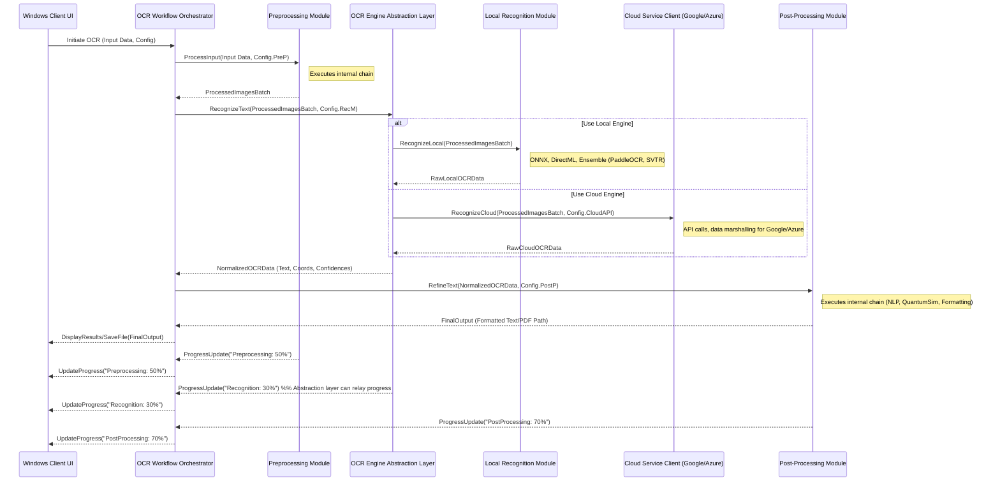

# OCR-X Project: Integration Patterns (Option B - Flexible Hybrid Powerhouse)

This document describes the integration patterns for the major components and sub-components of the OCR-X project (Option B - Flexible Hybrid Powerhouse), as identified in `OCR-X_Component_Breakdown_OptionB.md`.

## 1. Overall Workflow Orchestration

The OCR Workflow Orchestrator sub-component within the Windows Client Application is central to managing the OCR process. It operates as a stateful coordinator, guiding data through the pipeline.

**Primary Sequence:**

1.  **User Action & Input:** The user initiates an OCR task via the UI (e.g., selecting a file, pasting from clipboard, clicking "Start OCR"). The UI passes the input (e.g., file path, image object) and current configurations to the Orchestrator.
2.  **Preprocessing:** The Orchestrator invokes the **Input Handling & Preprocessing Module** with the raw input. This module executes its internal chain of sub-components and returns a batch of processed images (e.g., standardized NumPy arrays suitable for OCR).
    3.  **Recognition:** The Orchestrator passes the processed images to the **OCR Engine Abstraction Layer**. This layer is key to the "Flexible Hybrid Powerhouse" design. Based on current user/system configuration (engine choice), it routes the request to either the **Local Recognition Module (Ensemble Engine)** or one of the configured **Cloud OCR Service Clients (e.g., Google Document AI, Azure AI Vision)**. The selected engine performs text detection and recognition. The Abstraction Layer then receives the raw output from the chosen engine, normalizes it into a consistent internal data structure (regardless of the source engine), and returns this standardized, structured OCR data (text, bounding boxes, confidence scores) to the Orchestrator. This approach simplifies the Orchestrator's logic and ensures the Post-Processing module receives a predictable data format.
4.  **Post-Processing:** The Orchestrator then sends the *standardized* OCR data from the Abstraction Layer to the **Post-Processing Module**. This module refines the text using its sub-components (NLP correction, simulated quantum correction, formatting) and returns the final, user-ready output (e.g., formatted text string, path to a searchable PDF).
5.  **Output Display/Saving:** The Orchestrator receives the final output and passes it back to the UI for display to the user or to be saved to a file, as per user instructions.

**Progress and Status Updates:** Each major module (Preprocessing, Recognition (via Abstraction Layer which may relay sub-step progress), Post-Processing) will provide progress updates (e.g., percentage complete, current step) and status messages back to the Orchestrator, which then relays them to the UI for display. This is crucial for long-running tasks. Error handling (see Section 5) is also critical at each handoff point, especially from the Abstraction Layer, which needs to manage diverse error types from different engines.

```mermaid
sequenceDiagram
    participant UI as Windows Client UI
    participant Orch as OCR Workflow Orchestrator
    participant PreP as Preprocessing Module
    participant AbsL as OCR Engine Abstraction Layer
    participant LocalRM as Local Recognition Module
    participant CloudSC as Cloud Service Client (Google/Azure)
    participant PostP as Post-Processing Module

    UI->>Orch: Initiate OCR (Input Data, Config)
    Orch->>PreP: ProcessInput(Input Data, Config.PreP)
    Note right of PreP: Executes internal chain
    PreP-->>Orch: ProcessedImagesBatch
    
    Orch->>AbsL: RecognizeText(ProcessedImagesBatch, Config.RecM)
    alt Use Local Engine
        AbsL->>LocalRM: RecognizeLocal(ProcessedImagesBatch)
        Note right of LocalRM: ONNX, DirectML, Ensemble (PaddleOCR, SVTR)
        LocalRM-->>AbsL: RawLocalOCRData
    else Use Cloud Engine
        AbsL->>CloudSC: RecognizeCloud(ProcessedImagesBatch, Config.CloudAPI)
        Note right of CloudSC: API calls, data marshalling for Google/Azure
        CloudSC-->>AbsL: RawCloudOCRData
    end
    AbsL-->>Orch: NormalizedOCRData (Text, Coords, Confidences)

    Orch->>PostP: RefineText(NormalizedOCRData, Config.PostP)
    Note right of PostP: Executes internal chain (NLP, QuantumSim, Formatting)
    PostP-->>Orch: FinalOutput (Formatted Text/PDF Path)

    Orch-->>UI: DisplayResults/SaveFile(FinalOutput)
    
    %% Progress Updates (simplified)
    PreP-->>Orch: ProgressUpdate("Preprocessing: 50%")
    Orch-->>UI: UpdateProgress("Preprocessing: 50%")
    AbsL-->>Orch: ProgressUpdate("Recognition: 30%") %% Abstraction layer can relay progress
    Orch-->>UI: UpdateProgress("Recognition: 30%")
    PostP-->>Orch: ProgressUpdate("PostProcessing: 70%")
    Orch-->>UI: UpdateProgress("PostProcessing: 70%")
```

## 2. Integration within Core OCR Pipeline Modules

### Input Handling & Preprocessing Module

*   **Chaining:** The sub-components are chained sequentially, orchestrated by a main function within the Preprocessing Module itself, rather than individual calls from the global Orchestrator for each sub-step. This promotes modularity within the Preprocessing stage.
    1.  `Image Acquisition` is called first.
    2.  Its output is passed to `Format Conversion & Initial Validation`.
    3.  Then sequentially to `Adaptive Binarization`, `Geometric Correction`, and `Noise Reduction & Enhancement`.
*   **Data Format Consistency:**
    *   `Image Acquisition` will aim to produce a Pillow `Image` object or a list of them (for multi-page PDFs).
    *   `Format Conversion` converts these into OpenCV `Mat` objects (represented as NumPy arrays in Python). This NumPy array format is maintained for subsequent steps within the module.
    *   Each sub-component (Binarization, Geometric Correction, Noise Reduction) receives a NumPy array and returns a modified NumPy array.
*   **Configuration:** The Orchestrator passes preprocessing configurations (e.g., whether to enable specific steps, model paths for U-Net/DeepXY) to the main function of the Preprocessing Module, which then configures its sub-components accordingly.

### Local Recognition Module (Ensemble Engine)

*   **Input Provision (Ensemble):**
    *   Receives processed image data from the `OCR Engine Abstraction Layer` when the local path is selected.
    *   For an ensemble like PaddleOCR + SVTR, this image (or relevant text regions detected by PaddleOCR's detection model) is passed to both recognition models.
    *   If PaddleOCR's detector is used as the primary region proposer, these regions are fed to both PaddleOCR's recognizer and the SVTR recognizer. This can happen in parallel if resources allow, or sequentially.
*   **Output Collection:**
    *   Each local recognizer (PaddleOCR, SVTR) outputs its native structured data (text, confidence, coordinates per region).
    *   These outputs are collected for each region.
*   **Ensemble/Voting Logic:** The collected outputs from all active local recognizers for a given region are passed to the `Local Ensemble/Voting Logic` sub-component. This logic applies its rules to produce a single, consolidated OCR result for that region.
*   **Output to Abstraction Layer:** The final, consolidated result from the local ensemble (still in a potentially engine-specific or local-ensemble-specific format at this stage) is returned to the `OCR Engine Abstraction Layer` for normalization.
*   **ONNX Runtime-DirectML Interaction:**
    *   Both PaddleOCR and SVTR models (and any DL-based preprocessing models) are converted to ONNX format.
    *   The Local Recognition Module initializes `ONNX Runtime` inference sessions for these models, configured to use the DirectML execution provider.
    *   Input data (NumPy arrays) is formatted as required by the specific ONNX model and fed to the `run()` method of the inference session.
    *   The session executes the model on the GPU via DirectML and returns the output tensors, which are then decoded by the respective engine integration logic.

### OCR Engine Abstraction Layer Integration

*   **Purpose:** This layer acts as a pivotal switching point for all OCR requests. Its primary purpose is to decouple the `OCR Workflow Orchestrator` from the complexities and variations of individual OCR engines (local or cloud-based). This design promotes modularity, simplifies the Orchestrator's logic, and significantly eases the future addition or modification of OCR engines without impacting the rest of the pipeline. It is key to the "Flexible Hybrid Powerhouse" concept.
*   **Interface:**
    *   **Input:** Receives processed images (e.g., NumPy arrays or paths) from the Orchestrator, along with configuration parameters. These parameters specify the chosen engine (e.g., "local_ensemble", "google_document_ai", "azure_ai_vision"), relevant API keys or credential references, and any engine-specific settings (e.g., language hints, cloud model versions/endpoints).
    *   **Output:** Returns a robust, standardized internal OCR data structure (e.g., a well-defined Data Transfer Object - DTO - or a list of such DTOs). This DTO consistently contains recognized text, detailed bounding box coordinates (for various levels like character, word, line, block, if available from the engine), confidence scores (again, at multiple levels if provided), block type, orientation, and any other pertinent metadata. This structure is uniform regardless of the underlying engine used.
*   **Engine Selection Logic:** Based on the configuration provided, the Abstraction Layer dynamically:
    *   Retrieves necessary credentials securely (interacting with the Configuration Manager or a credential service).
    *   Instantiates the client for the selected local ensemble or specific cloud OCR engine.
    *   Passes the input data and relevant configurations to the chosen client.
*   **Output Normalization:** This is a critical function. The Abstraction Layer is responsible for transforming the diverse output formats, coordinate systems, and confidence score representations from different OCR engines (PaddleOCR, SVTR, Google API, Azure API all have unique response structures) into the single, consistent internal DTO. This involves:
    *   Mapping disparate field names to canonical DTO fields.
    *   Potentially adjusting coordinate systems (e.g., to a common top-left origin, relative or absolute).
    *   Handling optional data gracefully (e.g., if one engine provides character confidences but another doesn't).
    *   Ensuring all mandatory fields in the DTO are populated or have defined defaults.

### Cloud OCR Service Client Integration (Google/Azure)

*   **Client Responsibilities:** Separate, dedicated clients are implemented for each supported cloud service (e.g., a `GoogleDocumentAIClient` and an `AzureVisionClient`). Each client encapsulates all logic specific to interacting with its target cloud API and is responsible for:
    *   **Initialization:** Accepting API key/credentials passed by the Abstraction Layer (which in turn gets them securely via the Configuration Manager).
    *   **Request Formatting:** Converting the input image data (e.g., NumPy array) into the precise byte stream or structured payload (e.g., JSON) required by the cloud API. This includes setting API parameters like language hints, page ranges for multi-page documents, and selecting specific features or models offered by the API.
    *   **API Call (Resilient Patterns):** Making the actual HTTP request to the cloud service endpoint using the respective Google Cloud or Azure SDKs for Python. This includes robust authentication and implementing resilient API call patterns, such as:
        *   Configurable timeouts (connect and read).
        *   Retry mechanisms with exponential backoff and jitter for transient network errors or temporary API issues (e.g., HTTP 500, 503, rate limit exceeded errors where retrying is appropriate).
    *   **Response Handling:** Receiving the JSON (or other format) response from the cloud service. This includes comprehensively checking for successful API calls versus various error conditions (HTTP status codes, API-specific error messages, authentication failures, quota issues).
    *   **Data Extraction & Pagination:** Parsing the successful API response to extract all relevant OCR data: recognized text, detailed bounding box coordinates (words, lines, paragraphs, tables if available), confidence scores, block types, symbols, etc. If the cloud API paginates results for very large documents or many pages, the client must handle this transparently, making multiple requests if necessary to retrieve the complete OCR output for the submitted document(s).
*   **Interaction with Abstraction Layer:**
    *   The `OCR Engine Abstraction Layer` instantiates and invokes the appropriate cloud client when a cloud engine is selected.
    *   The client executes the API call(s) and returns the extracted, (potentially partially structured) OCR data or a well-defined error object/exception to the Abstraction Layer. The Abstraction Layer then performs the final normalization into the common internal DTO.

### Post-Processing Module

*   **Sequence of Operations:**
    1.  The raw OCR data (text strings, confidences, coordinates from the Recognition Module) is first passed to the **NLP-based Error Correction** (ByT5 ONNX model). This component processes the text and attempts to correct errors.
    2.  The output from NLP correction, potentially with updated confidence scores or flags for uncertain regions, is then analyzed. Specific ambiguities or low-confidence segments identified as suitable candidates for **Simulated Quantum Error Correction** are processed by the Qiskit-based QUBO simulation. This step is selective, not applied to all text.
    3.  The (now further refined) text is then passed to the **Formatting & Output Generation** sub-component, which produces the final output in the user-selected format(s) (plain text, JSON, searchable PDF).
*   **Data Passing:**
    *   Data is typically passed as a list of objects, where each object represents a text block or line and contains attributes for text, confidence, coordinates, and intermediate correction suggestions.
    *   The ByT5 model will output corrected text strings. Confidence scores might need to be re-evaluated or estimated based on the changes made.
    *   The Qiskit simulation will refine specific characters within the text strings.
    *   The formatting component uses the final text and original coordinate data (adjusted if necessary) to produce its output.

## 3. Client-Module Interaction

*   **UI to OCR Workflow Orchestrator:**
    *   **Event-Driven:** User actions in the UI (e.g., button clicks for "Open File", "Start OCR", changing settings) trigger events. These events are handled by UI event handlers, which then call corresponding methods in the OCR Workflow Orchestrator.
    *   **Data Passing:** File paths, image data (e.g., from clipboard), and selected configuration options are passed as arguments to the Orchestrator's methods.
    *   **Callbacks/Signals & Slots:** For progress updates and results, the Orchestrator uses callbacks or a signal/slot mechanism (common in frameworks like PyQt). When the Orchestrator receives progress updates from a processing module or the final result, it emits a signal or invokes a registered callback in the UI. The UI then updates progress bars, status messages, or displays the results. This ensures the UI remains responsive and non-blocking.
*   **Configuration Management:**
    *   The `Configuration Manager` sub-component loads settings when the application starts and saves them when they are changed by the user via the UI (e.g., selected engine, preprocessing defaults).
    *   When the Orchestrator initiates a processing module, it retrieves relevant general configuration settings from the Configuration Manager.
    *   For cloud API keys, the `OCR Engine Abstraction Layer` or the `Cloud OCR Service Clients` will request them as needed. The `Configuration Manager` itself doesn't hold the actual keys but provides the mechanism to access them from a secure store (like Windows Credential Manager via `keyring`, as detailed in Section 4). It will also store and provide the user's preferred OCR engine (local, Google, Azure) and any other engine-specific configurations that are not sensitive.

## 4. Data Storage and Access (Conceptual)

*   **Model Loading (Recognition Module):**
    *   ONNX model files (.onnx) for PaddleOCR, SVTR, ByT5, U-Net, DeepXY, etc., are stored in a designated local directory (part of the application installation or a user-configurable path).
    *   The `Configuration Manager` holds the paths to these model files.
    *   When the Recognition Module (or relevant Pre/Post-processing sub-component) initializes, it reads the model path from the configuration and loads the specified ONNX model into an `ONNX Runtime` inference session. This session is then retained for inference requests.
*   **Synthetic Data Access (Model Management & Retraining Framework):**
    *   The `Synthetic Data Generation Pipeline` (TRDG based) generates image files and corresponding ground truth text files, storing them in a structured local directory.
    *   The (conceptual) `Model Management & Retraining Framework` would have scripts that are configured to read data from these directories. These scripts would parse the file structure and ground truth files to load training samples for fine-tuning the various OCR models.
*   **API Key Storage:**
    *   User-provided API keys for cloud services will be securely managed. The primary mechanism will be integration with the Windows Credential Manager, accessed via Python's `keyring` library (or a similar robust library). This approach avoids storing sensitive keys in plain text configuration files. The `Configuration Manager` will facilitate the process for other components (like the `Cloud OCR Service Clients` via the `OCR Engine Abstraction Layer`) to request access to these stored credentials when needed for API calls. If Windows Credential Manager is unavailable or fails, a fallback to a securely encrypted local configuration file might be considered, though this is a secondary option requiring careful implementation of encryption/decryption. This aligns with NFR4 and the principles in `OCR-X_Security_Implementation.md`.

## 5. Error Handling and Propagation

*   **Within Modules/Sub-components:**
    *   Individual sub-components should use standard Python exceptions for critical errors (e.g., `FileNotFoundError`, `ValueError` for invalid parameters, custom exceptions for specific processing failures like `ModelLoadError` or `InferenceError`).
    *   For non-critical issues or warnings, they might log messages or return specific status codes/objects.
*   **Cloud API Specific Errors:**
    *   The `Cloud OCR Service Clients` and/or the `OCR Engine Abstraction Layer` must specifically handle errors related to cloud API interactions. These include, but are not limited to:
        *   Network errors (e.g., `requests.exceptions.ConnectionError`, timeouts).
        *   Authentication failures (e.g., invalid API key, insufficient permissions).
        *   API rate limits or quota exceeded by the cloud provider.
        *   Service-specific errors returned by the cloud API (e.g., badly formatted request, internal server error on the provider's side, unsupported image format for the specific cloud service).
    *   The `OCR Engine Abstraction Layer` should attempt to categorize these diverse cloud errors (and errors from local engines) into a more consistent set of error types before propagating them to the Orchestrator. This simplifies upstream error handling logic in the Orchestrator and UI (e.g., distinguishing between authentication failure, quota exceeded, transient network issue, invalid input to API, engine internal error).
*   **Propagation to Orchestrator:**
    *   The main function of each major module (Preprocessing, `OCR Engine Abstraction Layer`, Post-Processing) will have `try-except` blocks to catch exceptions from its sub-components or from API clients.
    *   If an error occurs that prevents the module from completing its task, it should propagate a standardized error object/exception (as categorized by the Abstraction Layer for recognition errors) to the `OCR Workflow Orchestrator`. This message or error type should be user-friendly or easily translatable into one. For cloud errors, it should clearly indicate the origin (e.g., "Google Document AI Error: [details]").
*   **Orchestrator to UI:**
    *   The Orchestrator, upon receiving an error from a module, will:
        1.  Log the detailed error, including any original exception information, for debugging.
        2.  Halt or modify the current OCR workflow as appropriate (e.g., stop further processing, or prepare for potential fallback).
        3.  Communicate a user-friendly error message (based on the categorized error type) to the UI via a signal or callback.
        4.  The UI will then display this error message to the user (e.g., in a dialog box or status bar).
*   **Graceful Degradation & Fallback Strategies:**
    *   For some non-critical errors (e.g., a specific enhancement filter failing in preprocessing), a module might be designed to continue processing with a default setting or by skipping that minor step, logging a warning.
    *   The `OCR Engine Abstraction Layer` could, in future enhancements or based on user configuration, support more advanced graceful degradation. For example, if a preferred cloud API call fails due to a transient network error or temporary service unavailability, the system could be configured to automatically attempt processing with a secondary engine (e.g., the local ensemble or an alternative cloud provider if multiple are configured). This would require clear user notification if a fallback occurs.

This integration strategy aims for a balance of modularity, clear data flow, and robust error handling, leveraging asynchronous patterns to ensure a responsive user experience in the Windows Client Application.
