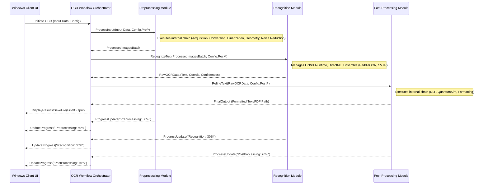

# OCR-X Project: Integration Patterns (Option B - On-Premise Powerhouse)

This document describes the integration patterns for the major components and sub-components of the OCR-X project (Option B - On-Premise Powerhouse), as identified in `OCR-X_Component_Breakdown_OptionB.md`.

## 1. Overall Workflow Orchestration

The OCR Workflow Orchestrator sub-component within the Windows Client Application is central to managing the OCR process. It operates as a stateful coordinator, guiding data through the pipeline.

**Primary Sequence:**

1.  **User Action & Input:** The user initiates an OCR task via the UI (e.g., selecting a file, pasting from clipboard, clicking "Start OCR"). The UI passes the input (e.g., file path, image object) and current configurations to the Orchestrator.
2.  **Preprocessing:** The Orchestrator invokes the **Input Handling & Preprocessing Module** with the raw input. This module executes its internal chain of sub-components and returns a batch of processed images (e.g., standardized NumPy arrays suitable for OCR).
3.  **Recognition:** The Orchestrator passes the processed images to the **Recognition Module (Ensemble Engine)**. This module performs text detection and recognition, potentially using its ensemble logic, and returns structured OCR data (text, bounding boxes, confidence scores).
4.  **Post-Processing:** The Orchestrator then sends this raw OCR data to the **Post-Processing Module**. This module refines the text using its sub-components (NLP correction, simulated quantum correction, formatting) and returns the final, user-ready output (e.g., formatted text string, path to a searchable PDF).
5.  **Output Display/Saving:** The Orchestrator receives the final output and passes it back to the UI for display to the user or to be saved to a file, as per user instructions.

**Progress and Status Updates:** Each major module (Preprocessing, Recognition, Post-Processing) will provide progress updates (e.g., percentage complete, current step) and status messages back to the Orchestrator, which then relays them to the UI for display. This is crucial for long-running tasks.

## 2. Integration within Core OCR Pipeline Modules

### Input Handling & Preprocessing Module

*   **Chaining:** The sub-components are chained sequentially, orchestrated by a main function within the Preprocessing Module itself, rather than individual calls from the global Orchestrator for each sub-step. This promotes modularity within the Preprocessing stage.
    1.  `Image Acquisition` is called first.
    2.  Its output is passed to `Format Conversion & Initial Validation`.
    3.  Then sequentially to `Adaptive Binarization`, `Geometric Correction`, and `Noise Reduction & Enhancement`.
*   **Data Format Consistency:**
    *   `Image Acquisition` will aim to produce a Pillow `Image` object or a list of them (for multi-page PDFs).
    *   `Format Conversion` converts these into OpenCV `Mat` objects (represented as NumPy arrays in Python). This NumPy array format is maintained for subsequent steps within the module.
    *   Each sub-component (Binarization, Geometric Correction, Noise Reduction) receives a NumPy array and returns a modified NumPy array.
*   **Configuration:** The Orchestrator passes preprocessing configurations (e.g., whether to enable specific steps, model paths for U-Net/DeepXY) to the main function of the Preprocessing Module, which then configures its sub-components accordingly.

### Recognition Module (Ensemble Engine)

*   **Input Provision (Ensemble):**
    *   For an ensemble like PaddleOCR + SVTR, the processed image (or relevant text regions detected by PaddleOCR's detection model) is passed to both recognition models.
    *   If PaddleOCR's detector is used as the primary region proposer, these regions are fed to both PaddleOCR's recognizer and the SVTR recognizer. This can happen in parallel if resources (especially GPU VRAM and compute units) allow, or sequentially if resource contention is an issue. Parallel execution would typically be managed via separate threads or asynchronous tasks feeding a common ONNX Runtime session queue if possible, or multiple sessions.
*   **Output Collection:**
    *   Each recognizer (PaddleOCR, SVTR) outputs:
        *   Recognized text string for each region.
        *   Confidence score(s) (per character/word/line).
        *   Bounding box coordinates (if not already provided by a shared detector).
    *   These outputs are collected as structured objects (e.g., Python dictionaries or custom classes) for each region.
*   **Ensemble/Voting Logic:** The collected outputs from all recognizers for a given region are passed to the `Ensemble/Voting Logic` sub-component. This logic then applies its rules (e.g., highest confidence wins, weighted averaging, primary/secondary logic) to produce a single, consolidated OCR result for that region.
*   **ONNX Runtime-DirectML Interaction:**
    *   Both PaddleOCR and SVTR models (and any DL-based preprocessing models) are converted to ONNX format.
    *   The Recognition Module (and relevant parts of Preprocessing) initializes `ONNX Runtime` inference sessions for these models, configured to use the DirectML execution provider.
    *   Input data (NumPy arrays) is formatted as required by the specific ONNX model and fed to the `run()` method of the inference session.
    *   The session executes the model on the GPU via DirectML and returns the output tensors, which are then decoded by the respective engine integration logic.

### Post-Processing Module

*   **Sequence of Operations:**
    1.  The raw OCR data (text strings, confidences, coordinates from the Recognition Module) is first passed to the **NLP-based Error Correction** (ByT5 ONNX model). This component processes the text and attempts to correct errors.
    2.  The output from NLP correction, potentially with updated confidence scores or flags for uncertain regions, is then analyzed. Specific ambiguities or low-confidence segments identified as suitable candidates for **Simulated Quantum Error Correction** are processed by the Qiskit-based QUBO simulation. This step is selective, not applied to all text.
    3.  The (now further refined) text is then passed to the **Formatting & Output Generation** sub-component, which produces the final output in the user-selected format(s) (plain text, JSON, searchable PDF).
*   **Data Passing:**
    *   Data is typically passed as a list of objects, where each object represents a text block or line and contains attributes for text, confidence, coordinates, and intermediate correction suggestions.
    *   The ByT5 model will output corrected text strings. Confidence scores might need to be re-evaluated or estimated based on the changes made.
    *   The Qiskit simulation will refine specific characters within the text strings.
    *   The formatting component uses the final text and original coordinate data (adjusted if necessary) to produce its output.

## 3. Client-Module Interaction

*   **UI to OCR Workflow Orchestrator:**
    *   **Event-Driven:** User actions in the UI (e.g., button clicks for "Open File", "Start OCR", changing settings) trigger events. These events are handled by UI event handlers, which then call corresponding methods in the OCR Workflow Orchestrator.
    *   **Data Passing:** File paths, image data (e.g., from clipboard), and selected configuration options are passed as arguments to the Orchestrator's methods.
    *   **Callbacks/Signals & Slots:** For progress updates and results, the Orchestrator uses callbacks or a signal/slot mechanism (common in frameworks like PyQt). When the Orchestrator receives progress updates from a processing module or the final result, it emits a signal or invokes a registered callback in the UI. The UI then updates progress bars, status messages, or displays the results. This ensures the UI remains responsive and non-blocking.
*   **Configuration Management:**
    *   The `Configuration Manager` sub-component loads settings when the application starts and saves them when they are changed by the user via the UI.
    *   When the Orchestrator initiates a processing module (Preprocessing, Recognition, Post-Processing), it retrieves the relevant configuration settings (e.g., specific algorithm choices, model paths, thresholds) from the Configuration Manager and passes them as parameters to the module's main function or constructor.

## 4. Data Storage and Access (Conceptual)

*   **Model Loading (Recognition Module):**
    *   ONNX model files (.onnx) for PaddleOCR, SVTR, ByT5, U-Net, DeepXY, etc., are stored in a designated local directory (part of the application installation or a user-configurable path).
    *   The `Configuration Manager` holds the paths to these model files.
    *   When the Recognition Module (or relevant Pre/Post-processing sub-component) initializes, it reads the model path from the configuration and loads the specified ONNX model into an `ONNX Runtime` inference session. This session is then retained for inference requests.
*   **Synthetic Data Access (Model Management & Retraining Framework):**
    *   The `Synthetic Data Generation Pipeline` (TRDG based) generates image files and corresponding ground truth text files, storing them in a structured local directory.
    *   The (conceptual) `Model Management & Retraining Framework` would have scripts that are configured to read data from these directories. These scripts would parse the file structure and ground truth files to load training samples for fine-tuning the various OCR models.

## 5. Error Handling and Propagation

*   **Within Modules/Sub-components:**
    *   Individual sub-components should use standard Python exceptions for critical errors (e.g., `FileNotFoundError`, `ValueError` for invalid parameters, custom exceptions for specific processing failures like `ModelLoadError` or `InferenceError`).
    *   For non-critical issues or warnings, they might log messages or return specific status codes/objects.
*   **Propagation to Orchestrator:**
    *   The main function of each major module (Preprocessing, Recognition, Post-Processing) will have `try-except` blocks to catch exceptions from its sub-components.
    *   If an error occurs that prevents the module from completing its task, it should propagate a clear error message or a custom error object/exception to the OCR Workflow Orchestrator. This message should be user-friendly enough or translatable into a user-friendly message.
*   **Orchestrator to UI:**
    *   The Orchestrator, upon receiving an error from a module, will:
        1.  Log the detailed error for debugging.
        2.  Halt the current OCR workflow.
        3.  Communicate a user-friendly error message to the UI via a signal or callback.
        4.  The UI will then display this error message to the user (e.g., in a dialog box or status bar).
*   **Graceful Degradation (Optional):** For some non-critical errors (e.g., a specific enhancement filter failing in preprocessing), a module might be designed to continue processing with a default setting or by skipping that minor step, logging a warning that is also passed to the Orchestrator and potentially to the user.

This integration strategy aims for a balance of modularity, clear data flow, and robust error handling, leveraging asynchronous patterns to ensure a responsive user experience in the Windows Client Application.
